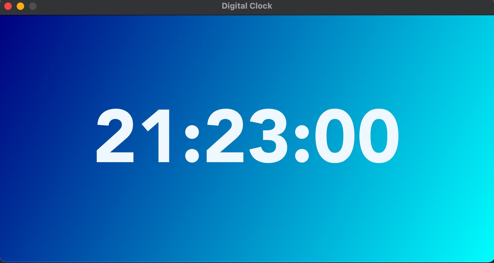

# Digital Clock


Desktop application written in Python with PyQt6.\
--> PyQt6 is a comprehensive set of Python bindings for the Qt6 application framework, that enables you to create beautiful GUI application using Python.


## Installation
Keep the project in a virtual environment. This way you make sure, that the packages installed will not affect other projects or operating system’s packages. 

1. Clone the repository:
   ```bash
   git clone https://github.com/tpreisig/digital-clock.git
   ```
2. Navigate to the project directory:
   ```bash
   cd digital-clock
   ```
3. Create a virtual environment and activate it:
   ```bash
   python3 -m venv dcl-venv
   source dcl-venv/bin/activate
   ```
4. Install the module PyQt6:
   ```bash
   pip install PyQt6
   ```

## Usage

To start the application, run:
```bash
python3 -m main
```

## License

This project is licensed under the MIT License - see the [LICENSE](LICENSE) file for details.

## Screenshots



## Contact

Maintained by tpreisig - feel free to reach out!
