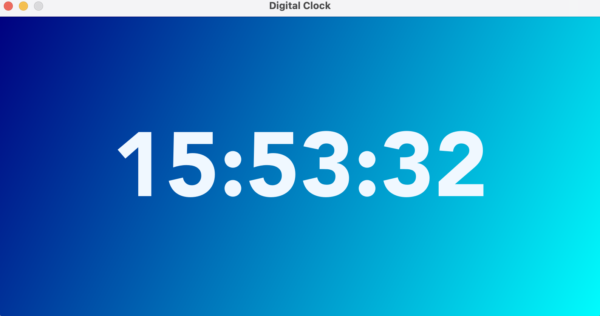

# Digital Clock

Desktop application written in Python with PyQt6, a comprehensive set of Python bindings for the Qt6 application framework, that enables you to create beautiful GUI application using Python.\
\
The following code sets up a QApplication instance, creates an instance of the DigitalClock class, which inherits from QWidget, configures its look and behavior, and starts a timer that updates the time displayed every second.\
\


## Installation

Keep the project in a virtual environment. This way you make sure, that the packages installed will not affect other projects or operating system’s packages. 

1. Clone the repository:
   ```bash
   git clone https://github.com/tpreisig/digital-clock.git
   ```
2. Navigate to the project directory:
   ```bash
   cd digital-clock
   ```
3. Create a virtual environment and activate it:
   ```bash
   python3 -m venv .venv
   source .venv/bin/activate
   ```
4. Install module PyQt6:
   ```bash
   pip install PyQt6
   ```

## Explanation and Usage

For the DigitalClock class, there is no `show()` method explicitly defined. However, the class inherits from QWidget, which iitself is a class in PyQt6 for creating windows and widgets. The QWidget has a `show()` method that makes the widget visible on the screen, even though the code for the DigitalClock class does not have such method called `show()`.

To start the application, run:

```bash
python3 -m main
```
